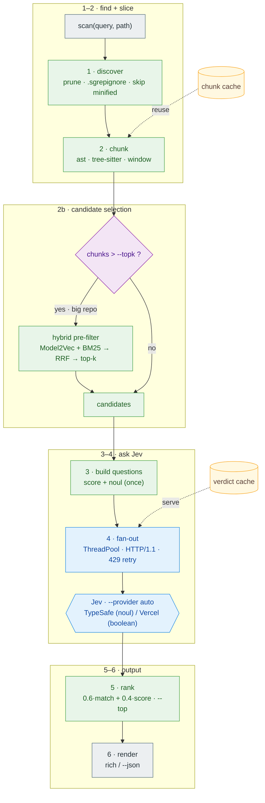

# Flow

How a `sgrep scan "<query>" <path>` runs, end to end.



> 🟩 local & free  ·  🟦 Jev API (network)  ·  🟨 on-disk cache  ·  🔷 decision

## Stages

1. **discover** — `discover.py` walks `<path>` with `os.walk` + in-place dir pruning (never
   descends into `.git`/`node_modules`/…), honors `.sgrepignore`, filters by extension /
   `--include` / `--exclude`, and skips files over ~1 MB and minified/generated ones (very
   long lines). Local, no network.

2. **chunk** — `chunkers/` slices each file into function / class units: `.py` via the
   stdlib `ast`, `.js/.jsx/.ts/.tsx/.java` via tree-sitter, and line windows as a
   universal fallback. Each chunk is tagged `file:start-end`. Local, no network.
   (graphify / claude-code plug in here later as richer structure providers.)

2b. **pre-filter (funnel, optional)** — when chunk count exceeds `--topk`, `prefilter/`
    scores every chunk locally with a **hybrid** filter — Model2Vec embeddings + BM25 fused
    via Reciprocal Rank Fusion — and keeps the **adaptive top-k** (knee between `--min-k`
    and `--topk`; `prefilter/select.py`). Turns "one HTTPS call per chunk" into "one per
    surviving candidate", and warns on likely under-recall (only on a hot boundary).
    Hybrid on purpose — each filter alone under-recalls; see DECISIONS.md D12/D14. Local.

3. **build questions** — `engine.build_questions(query)` turns the query into ONE
   reusable question set (built once, reused for every chunk):
   ```jsonc
   {
     "relevance": { "type": "score", "instructions": "...match the intent: '<query>'?",
                    "criteria": ["unrelated", "loosely related", "directly implements"] },
     "match":     { "type": "noul",  "instructions": "Does this code ...: '<query>'?" }
   }
   ```

4. **fan-out** — `engine.scan()` serves cached chunks and sends the misses to the chosen
   provider in parallel (`ThreadPoolExecutor`, default 16, pooled HTTP/1.1; 429/5xx retried
   with `Retry-After`). Provider is `--provider auto` (TypeSafe direct by default, Vercel
   opt-in). Each call, e.g. TypeSafe direct:
   ```jsonc
   POST https://api.typesafe.ai/v1/systemone
   { "model": "jev-latest", "state": "<one chunk>", "questions": <the set above> }
   ```
   (Vercel uses `POST /v4/ai/evaluation-model` and spells the yes/no type `boolean`.)
   Response (normalized in `clients/http_base.py`):
   ```jsonc
   { "answers": {
       "relevance": { "score": 1.74, "confidence": 0.6,
                      "probabilities": {"0":0.02,"1":0.23,"2":0.75} },  // -> 1.74/2 = 0.87
       "match":     { "noul": 0.96 } } }
   ```
   Verdicts are written back to the cache.

5. **rank** — `Verdict.rank_key = 0.6*match + 0.4*score`; filter by `--threshold`
   (on `match`), sort, take `--top`. Local.

6. **render** — `render.py` prints a ripgrep-style list (score bar, `file:line`, a
   signature-preview line) or `--json`.

## Data shapes
- `Chunk(file, start_line, end_line, text)`
- `Verdict(chunk, score, match, confidence, error)` — `score`/`match` are 0..1.

## Latency profile (measured on a 119-file / ~2.9k-chunk monorepo)
- Single Jev call: **~0.35–0.4s** (network RTT dominates; Jev itself is fast).
- Parallel fan-out via TypeSafe direct: **~28 req/s**; a fresh 50-chunk scan ≈ 2.6s.
- Cold full scan: **~9s → ~2.6s** after the latency work; **cached re-run ~0.0s**.
- Levers: os.walk dir-pruning, `.sgrepignore` + minified-skip (2929 → 404 chunks), the
  hybrid pre-filter funnel, per-file chunk cache + verdict cache, pooled HTTP/1.1,
  `HF_HUB_OFFLINE`, and a 2000-char pre-filter text cap.
- **Tracing a flow (multiple queries):** `sgrep scan Q -q Q2 -q Q3` (max 3) shares one
  discovery + parse + embedding pass and one bounded fan-out pool across all queries — ~2×
  vs running them separately. See DECISIONS.md D19.
- **Warm daemon** (`sgrep serve` + `--daemon`) keeps the process + Model2Vec model
  resident, removing the ~2s floor (Model2Vec load + Python startup). Ladder for a 3-query
  batch: cold 7.9s → warm daemon 5.3s → cached (verdict hits) 1.1s.
