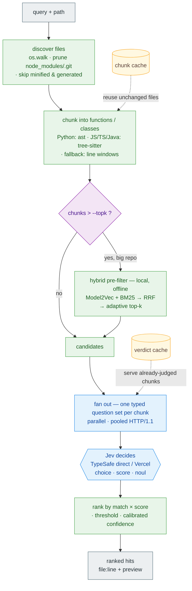

# sgrep — semantic grep, powered by Jev

Ask your codebase questions in plain English:

```bash
sgrep scan "which code handles authentication" ./src
```

Instead of matching keywords (grep) or building a vector index (embeddings),
`sgrep` slices your repo into chunks and asks **Jev** (TypeSafe's System One model)
one cheap typed question per chunk: _"does this match the query?"_ — then ranks the
answers by calibrated confidence.

Because a Jev call is ~150 tokens, ~100ms, and output is free, scanning a whole
repo costs pennies — cheap enough to run in CI on every PR.

## Install

```bash
# global, isolated `sgrep` command (recommended for a CLI):
pipx install .

# or into the current environment (editable for development):
pip install -e .

# then, from anywhere:
sgrep scan "which code handles authentication" ./src
```

Requires Python 3.10+. First run downloads a tiny (~7 MB) local embedding model for the
pre-filter. Add your provider key(s) to a `.env` (see **Providers** below).

To build distributables: `python -m build` (produces `dist/*.whl` and `*.tar.gz`);
publish with `twine upload dist/*`.

## How it works



> 🟩 local & free · 🟦 Jev API (network) · 🟨 on-disk cache

- **No persistent vector index to build or keep in sync** — the local pre-filter embeds
  on the fly (only when a repo exceeds `--topk`); Jev makes the actual decision.
- **Meaning, not keywords:** `verify_jwt()` scores high for "authentication" even
  without the word; a comment that merely mentions a term won't false-positive.
- **Scattering is irrelevant:** every chunk is judged independently, so matches are
  found no matter how many files/dirs they're spread across.

## Try it now (no setup)

```bash
# Offline mock Jev — runs anywhere, no API key:
python -m sgrep scan "which code handles authentication" sample_repo --mock

# Live Jev — reads TYPESAFE_API_KEY from .env:
python -m sgrep scan "which code handles authentication" sample_repo
```

## Options

| flag                       | meaning                                                                         |
| -------------------------- | ------------------------------------------------------------------------------- |
| `--threshold 0.6`          | minimum match probability to show                                               |
| `--top 20`                 | max hits                                                                        |
| `--window 60 --overlap 10` | chunk sizing (lines)                                                            |
| `--ext .py`                | restrict to extensions (repeatable)                                             |
| `--include / --exclude`    | glob filters (repeatable)                                                       |
| `--prefilter auto`         | local pre-filter before Jev: `auto`/`semantic` (Model2Vec) · `lexical` · `none` |
| `--topk 50`                | max candidates sent to Jev after the pre-filter (0 = no cap / exhaustive)       |
| `--min-k 8`                | adaptive floor: always keep at least this many candidates                       |
| `--no-adaptive`            | hard top-k cut instead of adaptive knee detection                               |
| `--mock`                   | offline stand-in for Jev                                                        |
| `--json`                   | machine-readable output                                                         |

## Structure-aware chunking

Files are chunked at **function / class** granularity, not arbitrary line blocks:
`.py` via the stdlib `ast`; `.js/.jsx/.ts/.tsx/.java` via tree-sitter (covers React
components, arrow functions, `export`-wrapped decls); line windows for everything else.
This gives precise `file:line` hits and better pre-filter recall.

## The funnel (big repos)

Judging every chunk means one HTTPS call per chunk. When a repo has more than `--topk`
chunks, `sgrep` first runs a **local, offline pre-filter** (Model2Vec static embeddings)
and sends only the **top-k** candidates to Jev — turning "1000 calls" into "50 calls".
The pre-filter is semantic on purpose: a keyword filter would drop the very code Jev is
best at finding (e.g. `verify_jwt` for "authentication"). Install with the extra:

```bash
pip install -e ".[all]"
# semantic pre-filter + tree-sitter parsers + rich UI
# or pick extras: .[semantic]  .[parsers]  .[ui]  (each degrades gracefully if absent)
```

## Providers

`sgrep` reads keys from a local `.env` (gitignored). Choose with `--provider`
(`auto` | `vercel` | `typesafe` | `mock`):

1. **TypeSafe direct** (`TYPESAFE_API_KEY`) — the default (`auto`). Fast (~2.6s for 50
   chunks). Override the endpoint with `SGREP_JEV_URL`.
2. **Vercel AI Gateway** (`VERCEL_AI_GATEWAY_API_KEY`) — opt-in via `--provider vercel`.
   Jev is free here, but the **free tier is heavily rate-limited** (even a 2-chunk scan
   429s out), so it's only practical with higher Vercel limits. 429s are retried with
   `Retry-After` backoff.
3. **Offline mock** (`--mock`).

## Ignoring files & caches

- **`.sgrepignore`** — gitignore-style patterns, loaded from the scan root and your
  cwd (so it doubles as a global ignore). Common build/vendor dirs and
  minified/generated files (very long lines) are skipped automatically.
- **Caches** (gitignored, disable with `--no-cache`): `.sgrep-chunkcache.json` skips
  re-parsing unchanged files; `.sgrep-cache.json` skips re-judging unchanged chunks.

## Roadmap

- **Phase 1 (now):** standalone semantic `scan` over line-window chunks.
- **Phase 2:** precise Python function/class chunks via stdlib `ast`.
- **Phase 3:** pluggable structure providers (graphify / tree-sitter / claude-code)
  behind the chunker seam — unlocks `sgrep trace` (semantic taint across the call
  graph) and `sgrep impact` (blast-radius).
