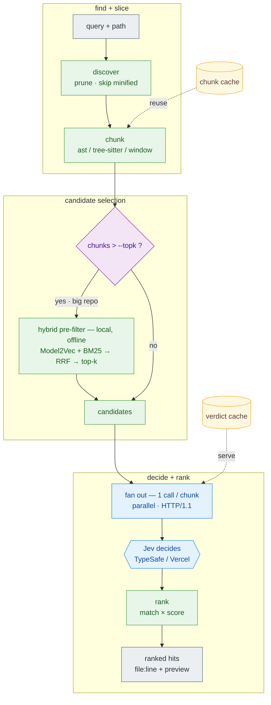

# sgrep — semantic grep, powered by Jev

Ask your codebase questions in plain English:

```bash
sgrep scan "which code handles authentication" ./src
```

Instead of matching keywords (grep) or building a vector index (embeddings),
`sgrep` slices your repo into chunks and asks **Jev** (TypeSafe's System One model)
one cheap typed question per chunk: _"does this match the query?"_ — then ranks the
answers by calibrated confidence.

Because a Jev call is ~150 tokens, ~100ms, and output is free, scanning a whole
repo costs pennies — cheap enough to run in CI on every PR.

## Install

```bash
# recommended — install straight from GitHub (no PyPI needed); command is `sgrep`:
pipx install "git+https://github.com/Lagnajit09/sgrep"

# pin a released version:
pipx install "git+https://github.com/Lagnajit09/sgrep@v0.2.0"

# or from a local checkout:
pipx install .            # global, isolated `sgrep` command
pip install -e .          # into the current environment (editable, for development)

# set your Jev key (pick one) — resolved: OS env var > ./.env > ~/.config/sgrep/.env
export TYPESAFE_API_KEY="sk-..."                    # macOS / Linux (add to ~/.zshrc to persist)
setx TYPESAFE_API_KEY "sk-..."                      # Windows PowerShell (persists for new sessions)
echo 'TYPESAFE_API_KEY=sk-...' >> ~/.config/sgrep/.env   # or set once, used from any dir

# optional backup provider — Vercel AI Gateway (auto falls back to it, or --provider vercel)
export VERCEL_AI_GATEWAY_API_KEY="vck-..."          # same three placements as above

# then, from anywhere:
sgrep scan "which code handles authentication" ./src
```

Requires Python 3.10+. First run downloads a tiny (~7 MB) local embedding model for the
pre-filter. On Windows the global config lives at `%APPDATA%\sgrep\.env` — see **Providers**
below for the full resolution order.

To build/publish: `python -m build` → `twine upload dist/*` (or `uv publish`).

## How it works



> 🟩 local & free · 🟦 Jev API (network) · 🟨 on-disk cache

- **No persistent vector index to build or keep in sync** — the local pre-filter embeds
  on the fly (only when a repo exceeds `--topk`); Jev makes the actual decision.
- **Meaning, not keywords:** `verify_jwt()` scores high for "authentication" even
  without the word; a comment that merely mentions a term won't false-positive.
- **Scattering is irrelevant:** every chunk is judged independently, so matches are
  found no matter how many files/dirs they're spread across.

## Try it now (no setup)

```bash
# Offline mock Jev — runs anywhere, no API key:
python -m sgrep scan "which code handles authentication" sample_repo --mock

# Live Jev — reads TYPESAFE_API_KEY from .env:
python -m sgrep scan "which code handles authentication" sample_repo
```

## Options

| flag                       | meaning                                                                         |
| -------------------------- | ------------------------------------------------------------------------------- |
| `--threshold 0.6`          | minimum match probability to show                                               |
| `--top 20`                 | max hits                                                                        |
| `--window 60 --overlap 10` | chunk sizing (lines)                                                            |
| `--ext .py`                | restrict to extensions (repeatable)                                             |
| `--include / --exclude`    | glob filters (repeatable)                                                       |
| `--prefilter auto`         | local pre-filter before Jev: `auto`/`semantic` (Model2Vec) · `lexical` · `none` |
| `--topk 50`                | max candidates sent to Jev after the pre-filter (0 = no cap / exhaustive)       |
| `--min-k 8`                | adaptive floor: always keep at least this many candidates                       |
| `--no-adaptive`            | hard top-k cut instead of adaptive knee detection                               |
| `-q, --query`              | add another query (repeatable, **max 3**); shares one startup + model load       |
| `--daemon`                 | use a warm `sgrep serve` daemon if running (JSON; falls back to in-process)      |
| `--mock`                   | offline stand-in for Jev                                                        |
| `--json`                   | machine-readable output                                                         |

## Structure-aware chunking

Files are chunked at **function / class** granularity, not arbitrary line blocks:
`.py` via the stdlib `ast`; `.js/.jsx/.ts/.tsx/.java` via tree-sitter (covers React
components, arrow functions, `export`-wrapped decls); line windows for everything else.
This gives precise `file:line` hits and better pre-filter recall.

## The funnel (big repos)

Judging every chunk means one HTTPS call per chunk. When a repo has more than `--topk`
chunks, `sgrep` first runs a **local, offline pre-filter** (Model2Vec static embeddings)
and sends only the **top-k** candidates to Jev — turning "1000 calls" into "50 calls".
The pre-filter is semantic on purpose: a keyword filter would drop the very code Jev is
best at finding (e.g. `verify_jwt` for "authentication"). The pre-filter model,
tree-sitter parsers, and rich UI all ship by default (see **Install** above) — each
degrades gracefully if a dependency is somehow missing.

## Going faster: batch queries & the warm daemon

Tracing a flow (e.g. "how does auth work?") usually takes a few related queries. Two
levers make that cheap — measured on Autosage's `autobot` (175 chunks):

**Batch mode** — pass up to **3** queries in one run with `-q`. Discovery, parsing, and
the Model2Vec embeddings are computed **once** and reused for every query, and all the
Jev calls share a single bounded pool (so concurrency never exceeds `--concurrency`,
staying rate-limit-safe):

```bash
sgrep scan "how are requests authenticated" ./autobot \
  -q "where are JWT tokens verified" \
  -q "service-to-service auth between backend services" --json
```

3 queries as separate cold runs ≈ **15.1s** → one batch run ≈ **7.3s** (2.1×). The cap is
3 on purpose: a flow needs a few *broad* queries, not many narrow ones.

**Warm daemon** — keep the process and the embedding model resident so each scan skips
the ~1–2s Python-startup + model-load floor:

```bash
sgrep serve            # start once (localhost only, token-authed); Ctrl-C to stop
sgrep scan "..." ./autobot --json --daemon      # ~1.8× faster per call
```

`--daemon` is fail-safe: if no daemon is running (or anything errors) it silently falls
back to an in-process scan. It serves `--json`; the rich report runs in-process. Batch +
daemon compose — 3 queries in one warm call ≈ **5.5s** (2.7× vs separate cold runs).

## Providers &amp; the API key

Choose the provider with `--provider` (`auto` | `vercel` | `typesafe` | `mock`):

1. **TypeSafe direct** (`TYPESAFE_API_KEY`) — the default (`auto`). Fast (~2.6s for 50
   chunks). Override the endpoint with `SGREP_JEV_URL`.
2. **Vercel AI Gateway** (`VERCEL_AI_GATEWAY_API_KEY`) — opt-in via `--provider vercel`.
   Jev is free here, but the **free tier is heavily rate-limited**, so it's only practical
   with higher Vercel limits. 429s are retried with `Retry-After` backoff. Set it **alongside**
   `TYPESAFE_API_KEY` as a **backup**: with `--provider auto`, sgrep falls back to Vercel when
   TypeSafe is unavailable.
3. **Offline mock** (`--mock`) — no key needed.

**Where to put the key** (resolved in this order, first one wins):

1. a real environment variable — best for CI / installed use;
2. `./.env` in the directory you run from (project-local);
3. a **global** `~/.config/sgrep/.env` (`%APPDATA%\sgrep\.env` on Windows) — set it once,
   use `sgrep` from anywhere.

```bash
# 1 · environment variable — macOS / Linux (add to ~/.zshrc or ~/.bashrc to persist)
export TYPESAFE_API_KEY="sk-..."

# 1 · environment variable — Windows PowerShell (persists for new sessions)
setx TYPESAFE_API_KEY "sk-..."

# 2 · project-local file
echo 'TYPESAFE_API_KEY=sk-...' >> ./.env

# 3 · global config — set once, use sgrep from any directory
mkdir -p ~/.config/sgrep && echo 'TYPESAFE_API_KEY=sk-...' >> ~/.config/sgrep/.env
# Windows: add TYPESAFE_API_KEY=sk-... to %APPDATA%\sgrep\.env

# backup provider — Vercel AI Gateway (fallback under --provider auto, or --provider vercel).
# Same three placements; just swap the variable name:
export VERCEL_AI_GATEWAY_API_KEY="vck-..."                     # macOS / Linux
setx VERCEL_AI_GATEWAY_API_KEY "vck-..."                       # Windows PowerShell
echo 'VERCEL_AI_GATEWAY_API_KEY=vck-...' >> ~/.config/sgrep/.env
```

The scanned repo's own `.env` is **never** read. If you use the daemon, the key must be in
the daemon process's environment or the global config (it's never sent over the wire).

## Ignoring files & caches

- **`.sgrepignore`** — gitignore-style patterns, loaded from the scan root and your
  cwd. Common build/vendor dirs and minified/generated files are skipped automatically.
- **Caches** live in a **global** per-repo directory — `~/.cache/sgrep/<repo>-<hash>/`
  (`%LOCALAPPDATA%\sgrep\...` on Windows), keyed by the resolved scan path. So they never
  pollute the scanned repo or your cwd, and are reused no matter where you invoke sgrep
  from. `.sgrep-chunkcache.json` skips re-parsing unchanged files; `.sgrep-cache.json`
  skips re-judging unchanged chunks. Override the base with `SGREP_CACHE_DIR`, or disable
  with `--no-cache`.

## Trace & impact (graphify)

`scan` finds *where* code is; **`trace`** and **`impact`** show *how it connects*, by
pairing Jev's semantic seeds with a [graphify](https://github.com/) call graph
(`graphify-out/graph.json`). sgrep reads the graph graphify already builds — run
`graphify update <repo>` to (re)build it, or pass `--refresh`.

```bash
# the flow: seeds (Jev) expanded along callers + callees
sgrep trace "how is a user script dispatched to the worker" ./server

# blast radius: everything that (transitively) depends on the matched code
sgrep impact "the standard JSON API response helper" ./server

# pin an exact node instead of a Jev query (offline, precise) — name or file:line
sgrep impact --symbol build_worker_payload ./server
sgrep trace  --symbol executor.py:15 ./server
```

`trace` walks `calls,method` (add `uses` etc. with `--relations`); `impact` walks callers
upstream. Both drop test files (`--include-tests` to keep them) and language built-ins, and
guard against graphify's generic-name hubs, so the output stays the real flow, not a
hairball. `--symbol` seeds from an exact graph node (no Jev call); `--json` for pipelines;
`--hops`, `--top` (seeds), `--max-nodes` to tune.

**When to use:** `trace`/`impact` shine on **connection / dependency / blast-radius**
questions — measured **2–3× fewer tokens and faster** than manual or plain `scan` there
(BENCHMARK.md). For "find / describe this" questions, plain `scan` is already cheaper — the
call graph is extra to read.

## Benchmarks

On a Claude agent tracing real flows through a distributed app, using sgrep (batch +
warm daemon) to locate code instead of manual grep-and-read cut **total tokens ~40%** and
**code read into context ~66%** at equal answer quality, and — with batch + daemon — was
faster on wall-clock too. Full methodology, per-domain numbers, and caveats in
[BENCHMARK.md](BENCHMARK.md).

## Use it from Claude Code &amp; Codex (the sgrep skill)

sgrep ships an **agent skill** so coding assistants reach for `scan` / `trace` / `impact`
on their own — the agent still runs the CLI you installed above; the skill just teaches it
*when* (find/how-does-X-work → `scan`; what-breaks-if-I-change-Y → `trace`/`impact`). One
canonical `SKILL.md`
([plugins/sgrep/skills/sgrep/SKILL.md](plugins/sgrep/skills/sgrep/SKILL.md)) serves both
agents; the same `plugins/sgrep/` directory carries a Claude Code manifest
(`.claude-plugin/plugin.json`) and a portable [Agent Plugins](https://agent-plugins.org)
manifest (`plugin.json`) side by side.

**Claude Code** — install from the plugin marketplace in this repo (one-time trust prompt):

```bash
/plugin marketplace add Lagnajit09/sgrep
/plugin install sgrep@sagex-tools
```

Claude then uses sgrep automatically for "where/how does X work?" and "what breaks if I
change Y?" questions; you can still invoke it explicitly with `/sgrep:sgrep`.

**Codex CLI** — add the same repo as an [Agent Plugins](https://agent-plugins.org)
marketplace (declared in [.agents/plugins/marketplace.json](.agents/plugins/marketplace.json)),
then install the plugin:

```bash
codex plugin marketplace add Lagnajit09/sgrep
codex plugin add sgrep@sagex-tools
```

Invoke it explicitly with `$sgrep`, or let Codex auto-select it on a matching request
(`codex plugin list --marketplace sagex-tools` shows its status). Prefer no marketplace?
Drop the skill straight into Codex's personal skills dir instead:

```bash
git clone https://github.com/Lagnajit09/sgrep ~/.sgrep-src
cp -r ~/.sgrep-src/plugins/sgrep/skills/sgrep ~/.agents/skills/sgrep   # or symlink it
```

Both need the `sgrep` CLI on your PATH and a `TYPESAFE_API_KEY` (see **Providers** &amp; the
API key); `trace`/`impact` also need a graphify graph. The skill wraps the CLI — it doesn't
install it.

## Roadmap

- **Phase 1 (now):** standalone semantic `scan` over line-window chunks.
- **Phase 2:** precise Python function/class chunks via stdlib `ast`.
- **Phase 3 (done):** graphify structure provider — `sgrep trace` (semantic seeds
  expanded along the call graph) and `sgrep impact` (reverse blast-radius). See above.
- **Phase 4 (done):** ships as a **Claude Code / Codex skill** so agents call
  `scan`/`trace`/`impact` automatically (`/plugin install sgrep@sagex-tools`). See above.
- **Next:** more structure providers; PyPI packaging.
